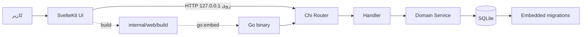
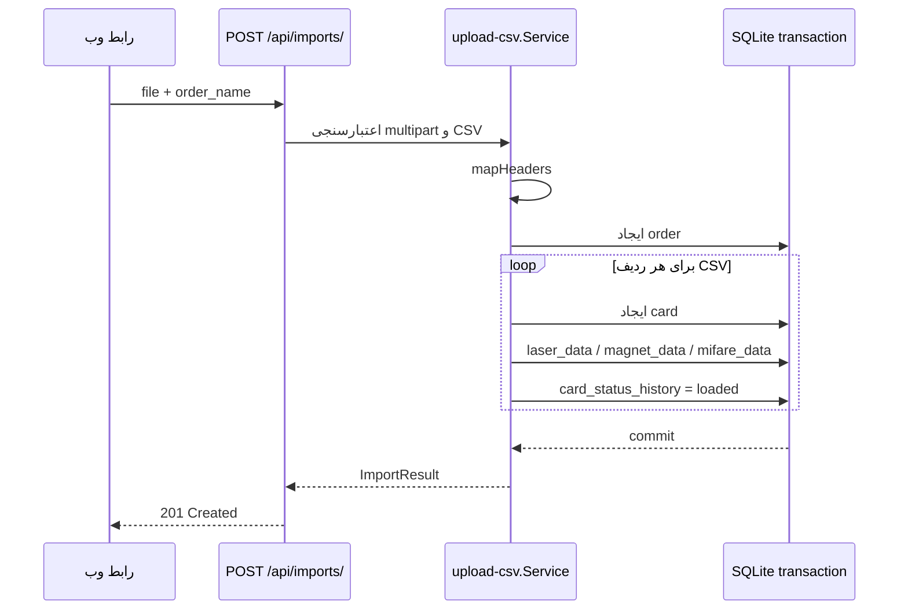
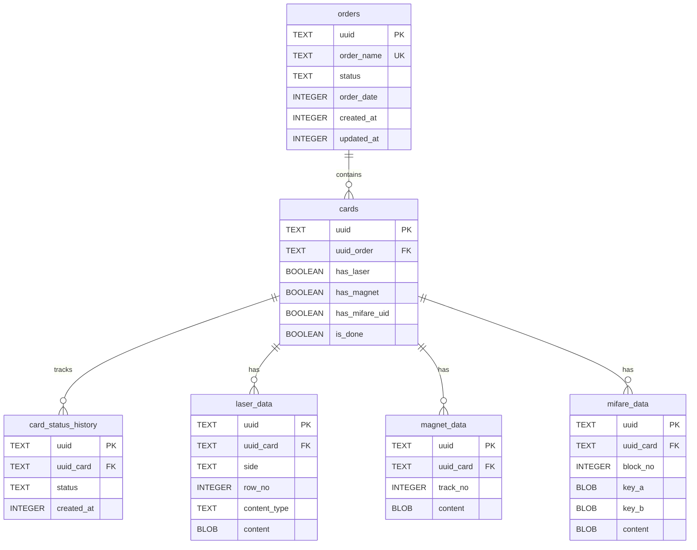

# Card Platform

سامانه‌ی دسکتاپ/لوکال برای واردسازی فایل CSV، آماده‌سازی اطلاعات شخصی‌سازی کارت، نگهداری داده‌های لیزر، نوار مغناطیسی و MIFARE و نمایش گزارش‌ها. هسته‌ی برنامه با Go نوشته شده است، رابط کاربری با SvelteKit ساخته می‌شود و خروجی frontend هنگام build داخل باینری Go embed می‌شود؛ بنابراین برای اجرای نسخه‌ی نهایی به Node.js نیاز نیست.

> وضعیت فعلی پروژه: مسیر اصلی اجرا `cmd/app` است. فایل `cmd/main` یک نمونه‌ی قدیمی/آزمایشی از سرور است و در Makefile استفاده نمی‌شود.

## فهرست مطالب

- [قابلیت‌ها](#قابلیت‌ها)
- [معماری و جریان داده](#معماری-و-جریان-داده)
- [ساختار پروژه](#ساختار-پروژه)
- [نیازمندی‌ها](#نیازمندی‌ها)
- [راه‌اندازی سریع](#راه‌اندازی-سریع)
- [Makefile](#makefile)
- [تنظیمات محیطی](#تنظیمات-محیطی)
- [قالب فایل CSV](#قالب-فایل-csv)
- [API](#api)
- [مدل داده و SQLite](#مدل-داده-و-sqlite)
- [توسعه‌ی backend و frontend](#توسعه‌ی-backend-و-frontend)
- [تست، lint و کنترل کیفیت](#تست-lint-و-کنترل-کیفیت)
- [بسته‌بندی ویندوز](#بسته‌بندی-ویندوز)
- [عیب‌یابی](#عیب‌یابی)
- [نکات مهم برای توسعه‌دهنده‌ی بعدی](#نکات-مهم-برای-توسعه‌دهندهی-بعدی)

## قابلیت‌ها

- بارگذاری CSV با `multipart/form-data` و ایجاد یک سفارش (`order`) و چند کارت (`card`) در یک تراکنش.
- تشخیص ستون‌های لیزر جلو/پشت، تصویر، UID مایفر و ترک‌های ۱ تا ۳ مگنت بر اساس نام header.
- ذخیره‌ی محتوای تصویر به‌صورت BLOB در SQLite.
- ایجاد placeholder با مقدار `UUID_PENDING` برای UIDهایی که باید بعداً از کارت‌خوان دریافت شوند.
- فهرست‌کردن، مشاهده‌ی جزئیات و حذف واردسازی‌ها؛ حذف سفارش به‌دلیل `ON DELETE CASCADE` داده‌های وابسته را نیز حذف می‌کند.
- API برای دریافت UIDهای pending، health check و خاموش‌سازی کنترل‌شده.
- جلوگیری از اجرای هم‌زمان دو نمونه روی یک پورت و بازکردن خودکار مرورگر.
- مهاجرت خودکار دیتابیس در اولین اجرا و بررسی checksum مهاجرت‌های قبلی.

## معماری و جریان داده



جریان واردسازی CSV:



لایه‌ها به این شکل از هم جدا شده‌اند:

| لایه | مسیر | مسئولیت |
|---|---|---|
| Entry point | `cmd/app/main.go` | ساخت DB، handlerها، router و HTTP server |
| Initialization | `internal/initialization` | wiring برنامه، پورت، مرورگر، shutdown |
| Routing/middleware | `internal/initialization/chi.go` و `internal/middleware` | routeها، CORS، request id، logging و recovery |
| Domain | `internal/domain/*` | منطق health، upload، pending data و shutdown |
| Database | `internal/db` | SQLite، migration و فایل‌های SQL |
| Generated DB code | `internal/db/sqlc` | کد تولیدشده؛ مستقیماً ویرایش نشود |
| Frontend | `frontend` | صفحات SvelteKit و assetهای قابل embed |
| Embedded UI | `internal/web` | `go:embed` برای `internal/web/build` |

## ساختار پروژه

```text
.
├── cmd/app/main.go              # اجرای اصلی برنامه
├── cmd/main/main.go             # نمونه‌ی قدیمی (در build اصلی استفاده نمی‌شود)
├── internal/
│   ├── config/                  # خواندن .env و متغیرهای محیطی
│   ├── common/                  # logger، jalali، load-file و خطاهای عمومی
│   ├── initialization/          # راه‌اندازی DB، router و web server
│   ├── middleware/              # request-id، logging، recovery
│   ├── domain/
│   │   ├── upload-csv/           # واردسازی و مدیریت orderها
│   │   ├── get-data/             # داده‌های pending مایفر
│   │   ├── health/               # liveness/readiness
│   │   └── shutdown/             # خاموش‌سازی امن
│   ├── db/
│   │   ├── migrations/           # migrationهای embed شده
│   │   ├── query/                # ورودی sqlc
│   │   └── sqlc/                 # خروجی تولیدشده
│   └── web/build/                # خروجی frontend که embed می‌شود
├── frontend/                    # پروژه SvelteKit
├── doc/                         # نمودارها و مستندات تکمیلی
├── Makefile
├── sqlc.yaml
├── .env
└── data.db                      # دیتابیس محلی نمونه/توسعه
```

## نیازمندی‌ها

- Go مطابق نسخه‌ی `go.mod` (در حال حاضر `go 1.26.5`).
- Node.js و npm برای build یا توسعه‌ی frontend.
- ابزار خط فرمان `sqlc` برای target `gen`.
- Git و یک مرورگر برای اجرای رابط وب.
- در لینوکس: `xdg-open` برای بازشدن خودکار مرورگر؛ در macOS از `open` و در ویندوز از `rundll32` استفاده می‌شود.
- برای نمایش پیام اجرای تکراری در لینوکس، یکی از `zenity`، `kdialog` یا `xmessage` باید نصب باشد.

## راه‌اندازی سریع

```bash
git clone <repository-url>
cd card-platform
go mod download
make build
./bin/myapp
```

در این repository فایل `.env` موجود است؛ در صورت نیاز مقادیر آن را تغییر دهید. اگر در branch دیگری فایل نمونه‌ای مثل `.env.example` وجود داشت، آن را به `.env` کپی کنید. برنامه روی `127.0.0.1:8080` گوش می‌دهد و مرورگر را باز می‌کند. اگر بازشدن خودکار انجام نشد، آدرس زیر را دستی باز کنید:

```text
http://127.0.0.1:8080
```

برای اجرای سریع بدون build کامل:

```bash
go run ./cmd/app
```

نکته: `go run` نیز migration را اجرا می‌کند و فایل دیتابیس را در مسیر تنظیم‌شده ایجاد/به‌روزرسانی می‌کند.

## Makefile

| دستور | عملکرد |
|---|---|
| `make gen` | اجرای `sqlc generate` و تولید فایل‌های `internal/db/sqlc` از migration/queryها |
| `make front` | اجرای `npm install`، سپس `npm run build` و کپی خروجی به `internal/web/build` |
| `make build` | اجرای `gen` و `front` و ساخت `bin/myapp` |
| `make run` | build کامل و اجرای `./bin/myapp` |
| `make build-windows` | build برای `windows/amd64` با `-H=windowsgui` در `bin/card-platform.exe` |

نمونه:

```bash
make gen
make front
make build
make run
make build-windows
```

`make front` به شبکه برای دریافت dependencyهای npm نیاز دارد. اگر فقط backend را تغییر داده‌اید و assetها تغییری نکرده‌اند، معمولاً `go test ./...` یا `go build ./cmd/app` کافی است.

## تنظیمات محیطی

فایل `.env` در شروع برنامه بارگذاری می‌شود. مقدار محیط سیستم بر مقدار فایل `.env` اولویت دارد.

| متغیر | پیش‌فرض | توضیح |
|---|---:|---|
| `APP_HTTP_PORT` | `8080` | پورت HTTP؛ فقط روی loopback bind می‌شود |
| `APP_NAME` | `card-platform` | نام برنامه |
| `APP_VERSION` | `2.0.0` | نسخه‌ی برنامه |
| `LOG_LEVEL` | `info` | سطح log فعلی |
| `DB_DRIVER` | `sqlite` | برای سازگاری تنظیمات؛ driver عملی SQLite است |
| `DB_DATASOURCE_NAME` | `./data.db` | مسیر فایل SQLite؛ مسیر نسبی نسبت به working directory است |

در Windows، اگر datasource نسبی باشد، هنگام اجرای GUI مسیر executable نیز برای پیدا کردن دیتابیس در نظر گرفته می‌شود. برای محیط production مسیر مطلق توصیه می‌شود:

```env
APP_HTTP_PORT=8090
DB_DATASOURCE_NAME=C:/CardPlatform/data.db
```

## قالب فایل CSV

ردیف اول باید header باشد و هر ردیف داده باید دقیقاً همان تعداد ستون را داشته باشد. headerها به حروف کوچک نرمال می‌شوند و ستون‌های ناشناخته نادیده گرفته می‌شوند؛ حداقل یک ستون map‌شده لازم است.

| پیشوند | مقصد | مثال | رفتار |
|---|---|---|---|
| `frn_` | `laser_data` با `side=front` | `frn_name` | متن؛ ترتیب ستون‌های front، `row_no` را تعیین می‌کند |
| `bck_` | `laser_data` با `side=back` | `bck_address` | متن؛ ترتیب ستون‌های back، `row_no` را تعیین می‌کند |
| `frn_img_` / `bck_img_` | `laser_data` با `content_type=image` | `frn_img_logo` | مقدار سلول مسیر فایل است و bytes فایل ذخیره می‌شود |
| `frn_uid` / `bck_uid` | `mifare_data` | `frn_uid` | مقدار `1` یا `true`، رکورد pending با block `-1` یا `-2` می‌سازد |
| `trk1_`، `trk2_`، `trk3_` | `magnet_data` | `trk2_data` | مقدار در track شماره‌ی ۱، ۲ یا ۳ ذخیره می‌شود |

نمونه‌ی حداقلی:

```csv
frn_name,frn_img_logo,bck_address,frn_uid,bck_uid,trk1_data,trk2_data,trk3_data
علی رضایی,./images/ali.png,"تهران، خیابان مثال",1,0,123456,654321,987654
```

نکات CSV:

- `order_name` اختیاری است؛ اگر ارسال نشود از نام فایل بدون پسوند ساخته می‌شود.
- `order_name` باید یکتا باشد؛ تکراری‌بودن پاسخ `409 Conflict` می‌دهد.
- مسیر تصویر روی filesystem همان ماشینی resolve می‌شود که backend در آن اجرا شده است، نه مرورگر کاربر.
- فایل خالی، بدون ردیف داده، بدون ستون `frn_`/`bck_`/`trk*` یا دارای header تکراری رد می‌شود.
- محدودیت backend برای body آپلود ۲ GiB است؛ UI فعلی فایل‌های بزرگ‌تر از ۱۰۰ MiB را پیش از ارسال رد می‌کند.
- واردسازی در یک transaction انجام می‌شود؛ خطای هر ردیف باعث rollback کل سفارش می‌شود.

## API

Base URL: `http://127.0.0.1:<APP_HTTP_PORT>`

### سلامت

| متد | مسیر | پاسخ |
|---|---|---|
| `GET` | `/health` | liveness عمومی |
| `GET` | `/health/liveness` | وضعیت زنده‌بودن و uptime |
| `GET` | `/health/readiness` | وضعیت dependencyها؛ در وضعیت فعلی checker خارجی ثبت نشده است |

نمونه:

```bash
curl http://127.0.0.1:8080/health/readiness
```

### واردسازی‌ها

`POST /api/imports/`:

```bash
curl -X POST http://127.0.0.1:8080/api/imports/ \
  -F 'order_name=order-1405-01' \
  -F 'file=@./sample.csv'
```

پاسخ موفق `201 Created` شامل `uuid`, `order_name`, `file_name`, `rows_imported`, `front_columns`, `back_columns` و `has_uid` است.

| متد | مسیر | توضیح |
|---|---|---|
| `POST` | `/api/imports/` | واردسازی CSV؛ فیلدهای multipart: `file` و اختیاری `order_name` |
| `GET` | `/api/imports/?limit=50` | فهرست سفارش‌ها؛ بازه‌ی معتبر limit بین ۱ تا ۲۰۰، پیش‌فرض ۵۰ |
| `GET` | `/api/imports/{uuid}` | جزئیات سفارش، تعداد کارت و تعداد ستون‌های front/back و UID |
| `DELETE` | `/api/imports/{uuid}` | حذف سفارش و همه‌ی داده‌های وابسته؛ پاسخ `204` |

خطاهای رایج upload: `400` برای CSV نامعتبر/فایل ناقص/نام سفارش خالی، `409` برای order تکراری و `500` برای خطای ذخیره‌سازی.

### داده‌های pending مایفر

```bash
curl 'http://127.0.0.1:8080/api/data/pending?limit=100'
```

`GET /api/data/pending` تعداد و فهرست رکوردهایی را برمی‌گرداند که `mifare_data.content = UUID_PENDING` دارند. limit معتبر بین ۱ تا ۱۰۰۰ و پیش‌فرض ۱۰۰ است. هر item شامل `card_uuid`, `order_uuid`, `order_name`, `block_no` و `created_at` است.

### خاموش‌سازی

```bash
curl -X POST http://127.0.0.1:8080/system/shutdown
```

این endpoint فقط از درخواست loopback (`127.0.0.1`/`::1`) پذیرفته می‌شود و پاسخ `202 Accepted` می‌دهد. علاوه بر API، سیگنال‌های `SIGINT` و `SIGTERM` نیز shutdown graceful با timeout ده‌ثانیه‌ای را فعال می‌کنند.

## مدل داده و SQLite



فایل migration فعلی `internal/db/migrations/001_init.up.sql` است. migrationها embed می‌شوند و در جدول `schema_migrations` با SHA-256 ثبت می‌گردند؛ پس از اعمال یک migration، تغییر محتوای همان فایل عمداً خطا ایجاد می‌کند. برای تغییر schema، migration جدید با شماره‌ی بالاتر اضافه کنید و migration قبلی را ویرایش نکنید.

SQLite با foreign key، WAL، `busy_timeout=5000` و `synchronous=NORMAL` باز می‌شود. timestampها در کد به‌صورت Unix milliseconds ذخیره می‌شوند، نه رشته‌ی ISO.

نمودار PlantUML قابل ویرایش در [doc/erDiagram.puml](doc/erDiagram.puml) و نمودار قدیمی/مفهومی در [doc/classdiagram.puml](doc/classdiagram.puml) قرار دارد.

## توسعه‌ی backend و frontend

### Backend

```bash
go run ./cmd/app
# یا
go build ./cmd/app
./card-platform
```

برای افزودن endpoint، در همان domain فایل‌های `model.go`, `service.go`, `handler.go` و `routes.go` را تکمیل کنید، سپس handler را در `internal/initialization/model.go` بسازید و route را در `internal/initialization/chi.go` mount کنید.

### Frontend

```bash
cd frontend
npm install
npm run dev
```

برای build production:

```bash
cd frontend
npm run check
npm run lint
npm run build
cd ..
cp -a frontend/build/. internal/web/build/
```

در حالت توسعه‌ی مستقل frontend، backend باید جداگانه روی پورت ۸۰۸۰ اجرا باشد. چون proxy در `vite.config.ts` تعریف نشده است، درخواست‌های نسبی API در dev server ممکن است نیازمند تنظیم proxy یا اجرای frontend از طریق build embed شده باشند.

## تست، lint و کنترل کیفیت

```bash
go test ./...
go vet ./...
go build ./cmd/app

cd frontend
npm run check
npm run lint
```

تست‌های فعلی منطق تشخیص header در `internal/domain/upload-csv/service_test.go` قرار دارند. برای تغییر parser، تست‌های خطا (header تکراری، تصویر ناموجود، CSV بدون ردیف و order تکراری) را نیز اضافه کنید.

## بسته‌بندی ویندوز

```bash
make build-windows
```

خروجی `bin/card-platform.exe` است. فلگ `-H=windowsgui` باعث می‌شود هنگام اجرای برنامه پنجره‌ی console باز نشود. دیتابیس باید کنار executable یا در مسیر مطلق قابل‌نوشتن باشد.

### رفتار اجرای تکراری

برنامه با bind کردن پورت روی `127.0.0.1` از اجرای هم‌زمان دو نمونه جلوگیری می‌کند. اگر کاربر برنامه را برای بار دوم اجرا کند:

- در ویندوز یک dialog native با گزینه‌ی تأیید/انصراف نمایش داده می‌شود.
- در Linux ابتدا `zenity`، سپس `kdialog` و در نهایت `xmessage` برای نمایش dialog استفاده می‌شود.
- فقط انتخاب گزینه‌ی «باز کردن برنامه» باعث اجرای browser روی آدرس نمونه‌ی اول می‌شود؛ انتخاب انصراف، نمونه‌ی دوم را بدون بازکردن browser می‌بندد.
- اگر محیط Linux هیچ ابزار dialog نداشته باشد، پیام در log ثبت می‌شود و browser به‌صورت خودکار باز نمی‌شود. برای Ubuntu/Debian می‌توانید یکی از این بسته‌ها را نصب کنید:

```bash
sudo apt install zenity
```

## عیب‌یابی

| نشانه | بررسی پیشنهادی |
|---|---|
| پورت اشغال است | `APP_HTTP_PORT` را تغییر دهید یا نمونه‌ی قبلی را از UI/`POST /system/shutdown` ببندید |
| مرورگر باز نمی‌شود | `http://127.0.0.1:<port>` را دستی باز کنید و وجود `xdg-open`/`open`/`rundll32` را بررسی کنید |
| خطای migration checksum | migration اعمال‌شده را ویرایش نکنید؛ فایل دیتابیس توسعه را backup و با migration جدید اصلاح کنید |
| خطای permission دیتابیس | پوشه‌ی `DB_DATASOURCE_NAME` باید قابل ایجاد و نوشتن باشد |
| تصویر CSV پیدا نمی‌شود | مسیر تصویر را نسبت به working directory backend یا به‌صورت absolute ارسال کنید |
| `sqlc: command not found` | sqlc را نصب کنید و دوباره `make gen` را اجرا کنید |
| frontend build قدیمی نمایش داده می‌شود | `make front` یا `make build` را اجرا کنید تا `internal/web/build` به‌روز شود |
| order تکراری | مقدار `order_name` باید یکتا باشد؛ فهرست موجود را با `GET /api/imports/` بررسی کنید |

برای مشاهده‌ی logها، برنامه را در همان terminal اجرا کنید. middleware logging، request id و recovery روی routeهای اصلی فعال هستند.

## نکات مهم برای توسعه‌دهنده‌ی بعدی

1. فایل‌های `internal/db/sqlc` تولیدشده‌اند؛ منبع واقعی queryها در `internal/db/query` و schema در `internal/db/migrations` است.
2. migration قبلی را بعد از استفاده در محیط واقعی تغییر ندهید؛ checksum این کار را تشخیص می‌دهد.
3. تمام تغییرات واردسازی باید transaction را حفظ کنند؛ partial import قابل قبول نیست.
4. کلیدهای `frn_uid` و `bck_uid` با blockهای منفی `-1` و `-2` مشخص می‌شوند و `UUID_PENDING` قرارداد بین import و مرحله‌ی خواندن کارت است.
5. برای تصاویر، bytes فایل در DB ذخیره می‌شود؛ در صورت افزایش حجم فایل‌ها، درباره‌ی storage جداگانه و محدودیت حجم تصمیم بگیرید.
6. `card_status_history` تاریخچه است و نباید با update روی یک رکورد قبلی جایگزین شود؛ برای هر مرحله رکورد جدید ثبت کنید.
7. endpoint خاموش‌سازی عمداً فقط loopback است؛ این محدودیت را بدون افزودن احراز هویت حذف نکنید.
8. CORS فعلی `AllowedOrigins: ["*"]` است و برنامه روی loopback اجرا می‌شود؛ اگر سرویس را شبکه‌ای کردید، CORS و authentication را بازبینی کنید.
9. پیش از تحویل نسخه، این زنجیره را اجرا کنید:

```bash
make gen
go test ./...
cd frontend && npm run check && npm run lint && cd ..
make build
```

10. اسناد تکمیلی پروژه در [doc/analyze.txt](doc/analyze.txt)، [doc/utilities.txt](doc/utilities.txt) و فایل‌های API در `doc/apis` قرار دارند.
